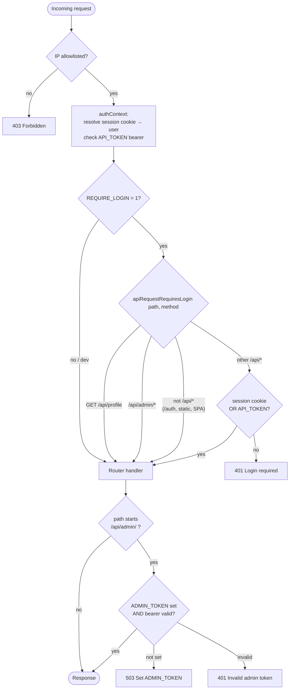
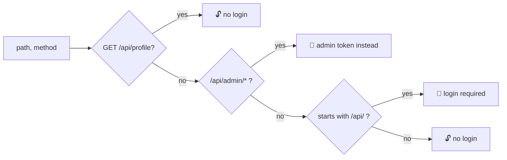
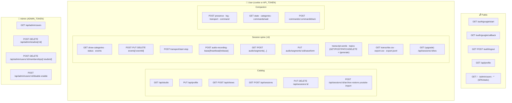

# Auth model & API map — autologger-cf

Reference for the HTTP/WS surface and how each route is authenticated.
Source of truth: `server/src/middleware/auth.ts`, `server/src/middleware/ipAllowlist.ts`,
`server/src/auth/identity.ts` (`apiRequestRequiresLogin`), and the per-router guards
in `server/src/routers/`. Regenerate if those change.

## Auth tiers

| Tier | Meaning | Credential | Enforced when |
|------|---------|------------|---------------|
| 🔓 **Public** | No auth | — | always open |
| 🍪 **User** | Logged-in user **or** machine client | Google session cookie **or** `API_TOKEN` bearer | only when `REQUIRE_LOGIN=1` (production serve path) |
| 🔑 **Admin** | Admin-only | `ADMIN_TOKEN` bearer | **always** (independent of `REQUIRE_LOGIN`) |

Notes:
- **IP allowlist** (`ipAllowlistMiddleware`) wraps *every* route as the outermost gate, before auth.
- In **dev** (`REQUIRE_LOGIN=0`, loopback) the 🍪 tier is effectively open — the IP allowlist is the only guard in front of it.
- **Admin is orthogonal**: `/api/admin/*` is *exempt* from the login gate but requires its own `ADMIN_TOKEN` — checked even in dev (returns `503` until the token is set, `401` if wrong). A session cookie grants **no** admin access.
- The **Companion** module authenticates machine-to-machine with `Authorization: Bearer <API_TOKEN>`, which satisfies the 🍪 tier. There is no separate "companion token."

## Request flow (middleware chain)

## Login gate rule (`apiRequestRequiresLogin`)

## API surface by tier

## Full route table

### 🔓 Public
| Method | Path | Notes |
|--------|------|-------|
| GET | `/auth/google/start` | OAuth entry |
| GET | `/auth/google/callback` | OAuth callback (production serve path only) |
| GET·POST | `/auth/logout` | |
| GET | `/api/profile` | the one `/api/` public exception |
| GET | `/` · `/admin/users` · `*` | SPA / static fallback |

### 🍪 User — Profile / Shows / Sessions
| Method | Path |
|--------|------|
| GET | `/api/studio` |
| PUT | `/api/profile` |
| GET·POST | `/api/shows` |
| GET·POST | `/api/sessions` |
| PUT·DELETE | `/api/sessions/:sessionId` |
| POST | `/api/sessions/:sessionId/archive` · `/restore` · `/youtube-import` *(503)* |

### 🍪 User — Session spine (`/api/sessions/:sessionId/…`)
| Method | Path |
|--------|------|
| GET | `show-categories` · `status` · `events` |
| POST | `events` |
| PUT·DELETE | `events/:eventId` |
| POST | `transport/start` · `transport/stop` |
| POST | `audio-recording-lease` · `/heartbeat` · `/release` |
| GET·POST | `audio/segments` |
| POST | `audio/segments/sync-from-disk` |
| GET | `audio/segments/:segmentId` |
| PUT | `audio/segments/:segmentId/waveform` |
| GET | `transcript-words` · `topics` · `transcribe.csv` |
| POST | `transcript-words` · `topics` · `transcript-words/generate` *(503)* · `topics/generate` *(503)* |
| PATCH·DELETE | `transcript-words/:wordId` · `topics/:topicId` |
| GET | `export.csv` · `export.jsonl` |
| GET (upgrade) | `ws` — live SessionHub fan-out |

### 🍪 User — Companion (`/api/companion/…`)
| Method | Path |
|--------|------|
| POST | `presence` · `log` · `transport` · `command` |
| GET | `state` · `categories` · `commands/wait` *(long-poll)* |
| POST | `commands/:commandId/ack` |

### 🔑 Admin (`/api/admin/…`)
| Method | Path |
|--------|------|
| GET | `users` |
| POST·DELETE | `studios` · `studios/:studioId` |
| POST·DELETE | `users/:userId/memberships` · `memberships/:studioId` |
| POST | `users/:userId/disable` · `enable` |

---
_~55 HTTP routes across 10 routers + 1 WebSocket endpoint. `(503)` marks endpoints intentionally
disabled on this Node deployment (transcription / YouTube import not wired up)._
